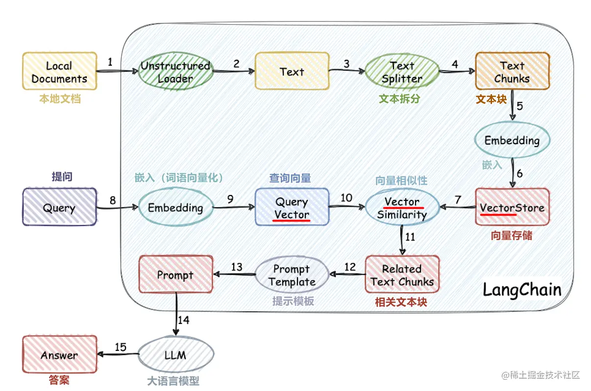

# 手把手从零教你搭建大模型知识库
本项目从零开始实现了大模型外接知识库的流程：
1. 中文数据集处理
2. 词向量模型训练
3. 文档向量化
4. 向量数据库存储知识库
5. 本地ChatGLM2-6B大模型部署
6. 简单的知识库应用



## 项目结构
- corpus：存放知识库文档的文件夹
- data：词向量模型训练相关的数据（模型文件较大，请自行下载模型）
- doc：词向量模型训练的源码、文档
- llm_server：简单的知识库应用
- vector_db：将corpus里的文档存入qdrant向量数据库
- config.json：项目的一些配置
  - OPENAI_API_KEY：openai的api key
  - EMBEDDING_MODEL_TYPE：文本向量化的模型openai或word2vec
  - CHAT_MODEL_TYPE：对话大模型openai或chatglm
  - CHATGLM_PORT：ChatGLM本地部署的端口
  - **PATH：一些路径，以项目根目录为起点
  - COLLECTION_NAME：向量数据库Collection的名称

## 运行
### 生成持久化知识库
```bash
cd vector_db
pip install -r requirements.txt
python main.py
```
main.py会自动创建名为COLLECTION_NAME的向量数据库，并将corpus文件夹中的文档向量化存储到数据库中

### 运行应用
```bash
cd llm_server
pip install -r requirements.txt
python main.py
```

### 运行本地部署的ChatGLM2-6B
参考ChatGLM2-6B[官方文档](https://github.com/THUDM/ChatGLM2-6B)

# 教程

- [训练word2vec](./doc/word2vec.ipynb)

- [手把手从零教你搭建大模型知识库](./doc/手把手教你从零搭建自己的知识库.md)

- [document.ai](https://github.com/GanymedeNil/document.ai)