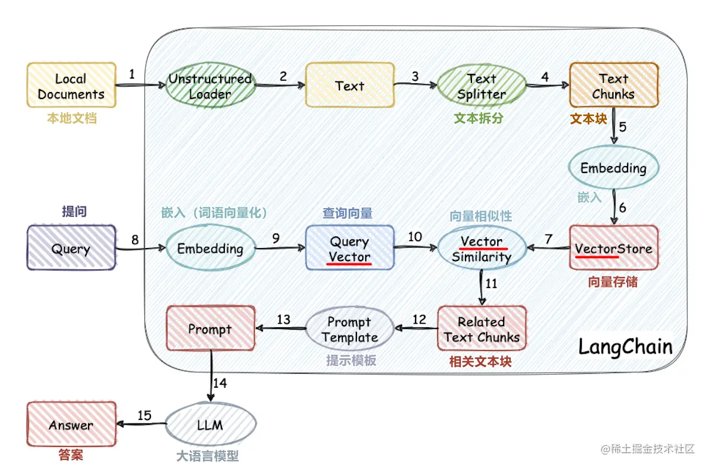

# 方案选择
目前已经有许多开源的方案，也有许多商业化的方案，基本上可以分为：

1. ChatGPT + Fine-tune： 微调出一个自己的模型，从一些大佬的反馈来看，这种方式成本高，需要花费很多精力去训练，效果不一定能够很好。可以看看 [如何使用OpenAI fine-tuning(微调)训练属于自己的专有模型？ - 知乎](https://link.juejin.cn?target=https%3A%2F%2Fwww.zhihu.com%2Fquestion%2F591066880) 和 [大模型外挂(向量)知识库 - 知乎](https://link.juejin.cn?target=https%3A%2F%2Fzhuanlan.zhihu.com%2Fp%2F633671394)
2. ChatGPT + 外挂知识库: 这个有两个方案，第一个就是官方提供的插件 [chatgpt-retrieval-plugin](https://link.juejin.cn?target=https%3A%2F%2Fgithub.com%2Fopenai%2Fchatgpt-retrieval-plugin) 来处理文档向量，[视频](https://link.juejin.cn?target=https%3A%2F%2Fcdn.openai.com%2Fchat-plugins%2Fretrieval-gh-repo-readme%2FRetrieval-Final.mp4) 效果演示，缺点就是只能在 ChatGPT 源站点使用，并且要有插件开发者权限。另一个是利用 LangChain 处理生成向量库，然后调用 ChatGPT openapi ， 带上检索出来的相关数据和问题去使用。
3. 开源 LLM + 微调: 就是利用开源的 LLM 微调训练目标的知识库，比如 [ChatGLM3](https://link.juejin.cn?target=https%3A%2F%2Fgithub.com%2FTHUDM%2FChatGLM3)，当然训练成本也是在的，但可以做到数据不泄露，前面 2 种始终需要通过 ChatGPT，难免出现一些数据泄露。
4. LangChain + 开源 LLM: 如果不想自己训练，又想保证数据安全，那么结合 2，3 点的方案则是安全可靠的，用 LangChain 对文档进行向量化，然后检索内容，在调用 LLM 对得到的内容进行总结输出。
# 环境搭建
## Python

1. 安装conda
```
brew install miniconda
```

1. 创建自定义虚拟环境
```
conda create -n [[name]]
```

1. 激活虚拟环境
```
conda activate [[name]]
```
## NLP相关依赖安装
自然语言处理，简称 NLP，是人工智能的一个分支，它允许机器理解、处理和操纵人类语言。
#### Pytorch
```
conda install pytorch
```
#### Numpy
```
conda install numpy
```
#### Scipy
```
conda install scipy
```
#### Gensim
⚠️gensim依赖于scipy和numpy，一定要先安装前两者再安装gensim
是一个著名的开源 Python 库，用于从原始的非结构化的文本中，无监督地学习到文本隐层的主题向量表达。Gensim 支持包括TF-IDF，LDA和 word2vec在内的多种主题模型算法，因此很多算法工程师会将其作为主题建模的首选库。
```
conda install -c conda-forge gensim
```
# NLP基础概念

- 标记(Token)： 是具有已知含义的字符串，标记可以是单词、数字或只是像标点符号的字符。“你好”、“123”和“-”是标记的一些示例。
- 句子(Sentence)： 是一组意义完整的记号。“天气看起来不错” 是一个句子的例子，句子的标记是【“天气”, “看起来”, “不错“】。
- 段落(Paragraph)： 是句子或短语的集合，也可以将句子视为段落的标记。
- 文档(Documents)： 可能是一个句子、一个段落或一组段落。发送给个人的文本消息是文档的一个示例。
- 语料(Corpus)： 通常是作为词袋的原始文档集合。语料库包括每个记录中每个单词的 id 和频率计数。语料库的一个例子是发送给特定人的电子邮件或文本消息的集合。
- 稀疏向量(SparseVector)： 通常，我们可以略去向量中多余的0元素。此时，向量中的每一个元素是一个(index, value)的元组
- 模型(Model)： 是一个抽象的术语。定义了两个向量空间的变换（即从文本的一种向量表达变换为另一种向量表达）。


# 模型介绍
## Word2vec
Word2Vec是一种用于处理自然语言处理的模型，它是在2013年由Google的研究员Mikolov等人首次提出的。Word2Vec通过训练海量的文本数据，能够将每个单词转换为一个具有一定维度的向量。这个向量就可以代表这个单词的语义。因为这个向量是在大量语境中学到的，所以这个向量能很好的表达这个单词的语义。
Word2Vec包括Skip-Gram和CBOW两种模型，主要是通过优化模型计算词与词之间的关系，从而获得词的向量表示。
Skip-Gram模型是通过一个词预测其上下文。举个例子，给定词汇"苹果"，Skip-Gram模型的目标是生成它的上下文"吃了一个大"和"感觉真满足"。
CBOW模型是给定一个词的上下文词汇，预测这个词。比如，给定上下文"吃了一个大"和"感觉真满足"，CBOW模型会预测中间的词汇，也就是"苹果"。
这两种模型都是通过学习词汇与其上下文之间的关系，获得词的向量表示。这两个向量的距离可以用来衡量两个词语义上的相似度，距离越近意味着两个词语义上越相似。
## 同类型模型
word2vec模型已经很老了，本教程主要用于教学，让读者对大模型相关知识有一些实践的了解，故不强追求质量效率等。若读者感兴趣，可尝试其他词向量模型

1. **GloVe（Global Vectors for Word Representation）**：这是Stanford大学开发的一个词向量模型。不同于Word2Vec，GloVe会在全局的词频统计上进行建模从而生成词向量。因此会比Word2Vec更注重词与词之间的共现信息。
2. **FastText**：这是Facebook AI研究团队开发的一种模型，它在Word2Vec的基础上进行了扩展。FastText不仅考虑整体词的信息，还考虑词中的子词信息。这使得FastText可以更好地处理词形变化以及拼写错误等问题。
3. **ELMo（Embeddings from Language Models）**：ELMo模型把词的语境信息也考虑在内，它认为每一个词的表示应依赖于整个输入的句子。通过这种动态的词向量，ELMo模型在很多NLP任务中达到了很好的效果。
4. **BERT（Bidirectional Encoder Representations from Transformers）**：这是Google在2018年提出的模型。BERT通过使用Transformer模型，对上下文进行双向全覓敵，从而对每个词生成更加丰富的向量表示。BERT在一系列的NLP任务中都取得了非常好的效果。
# 数据处理
## 中文wiki
[https://dumps.wikimedia.org/zhwiki/](https://dumps.wikimedia.org/zhwiki/)
### 数据提取
按照具体数据集的规范解压提取出数据
### 数据处理
#### opencc
Open Chinese Convert（OpenCC）是一个开源的中文简繁转换项目，致力于制作高质量的基于统计语料的简繁转换词库。还提供函数库(libopencc)、命令行简繁转换工具、人工校对工具、词典生成程序、在线转换服务及图形用户界面。
```bash
pip3 install opencc-python-reimplemented
```
对于数据集我们需要依此进行四个操作：

1. 过滤中文
2. 简化中文
3. 中文分词
4. 除去停用词

其中繁体转简体 和 分词 所花费的时间 占大头
## 清华大学自然语言处理实验室数据集
[http://thuctc.thunlp.org/#%E6%A0%B7%E4%BE%8B%E7%A8%8B%E5%BA%8F](http://thuctc.thunlp.org/#%E6%A0%B7%E4%BE%8B%E7%A8%8B%E5%BA%8F)
### 数据提取
我们下载的是.zip文件，先原地解压THUCNews.zip

### 数据处理
对于数据集我们需要依此进行四个操作：

1. 过滤中文
2. 简化中文
3. 中文分词
4. 除去停用词
## 数据合并
需要把所有数据集合并为一个数据集，作为最终训练模型用的数据集
# 模型训练
数据集并不大，m2 pro性能也很能打了，直接在本地硬造就行。
训练10轮，m2 pro 32g大约一个半小时可以完成
```python
model = Word2Vec(sentences, vector_size=300, window=5, epochs=10, compute_loss=True, callbacks=[epoch_logger])
```
# 模型使用
## 词向量生成
```python
print(model.vector_size)
print(model.total_train_time)
print(model.wv.most_similar('猫'))
print(model.wv.most_similar('吉林大学'))
```
结果：
```
300
4965.289603250014
[('狗', 0.7110657691955566), ('猫咪', 0.671169638633728), ('小猫', 0.6650978326797485), ('兔子', 0.6501124501228333), ('小狗', 0.6325607895851135), ('小猫咪', 0.6306896805763245), ('犬', 0.6204975843429565), ('宠物猫', 0.6035280227661133), ('吉娃娃', 0.5858094096183777), ('宠物狗', 0.5799086093902588)]
[('东北师范大学', 0.7164520621299744), ('大连理工大学', 0.6689789295196533), ('哈尔滨工程大学', 0.6448072791099548), ('哈尔滨工业大学', 0.6404638886451721), ('西北农林科技大学', 0.637593150138855), ('东北财经大学', 0.6347334384918213), ('中国医科大学', 0.630100429058075), ('杭州大学', 0.6278619766235352), ('华东政法学院', 0.6263515949249268), ('白求恩医科大学', 0.6260219216346741)]
```
## 句向量生成
word2vec模型本身只能对词语进行embedding操作，如果想对句子进行embedding，有以下几种方法：

1. 平均值：最简单的做法是将句子中所有词的向量进行平均。这会给你一个固定长度的向量，可以用作句子的embedding，但是这种方法不包含句子的语序信息。
2. TF-IDF加权平均：与简单的平均法类似，但是每个词的权重与其在句子中的TF-IDF值成比例。这可以强调句子中更重要的词，但仍然不包含语序信息。
3. Doc2Vec：这是一种在word2vec模型上进行了扩展，可以包含更大的上下文信息，即全文信息。Doc2Vec可以生成一个整体的句子向量，且保留了语序信息。
4. 神经网络：可以使用深度学习模型，如RNN，GRU，LSTM或Transformer，这些模型可以利用word2vec词向量生成句子的嵌入向量，并且能捕捉到句子中的词序。

我们采用最简单的第一种方法
```python
def encode(self, sentences: List[str], show_progress_bar: bool = False) -> ndarray:
    all_embeddings = []
    for sentence in tqdm(sentences, desc='Word2Vec Embeddings', disable=not show_progress_bar):
        emb = []
        count = 0
        for word in sentence:
            # 过滤停用词
            if word in self.stopwords:
                continue
            # 调用词向量
            if word in self.w2v.key_to_index:
                emb.append(self.w2v.get_vector(word, norm=True))
                count += 1
            else:
                if len(word) == 1:
                    continue
                # 再切分
                ws = self.jieba.lcut(word, cut_all=True, HMM=True)
                for w in ws:
                    if w in self.w2v.key_to_index:
                        emb.append(self.w2v.get_vector(w, norm=True))
                        count += 1
        tensor_x = np.array(emb).sum(axis=0)  # 纵轴相加
        if count > 0:
            avg_tensor_x = np.divide(tensor_x, count)
        else:
            avg_tensor_x = np.zeros(self.w2v.vector_size, dtype=float)
        all_embeddings.append(avg_tensor_x)
    all_embeddings = np.array(all_embeddings, dtype=float)
    if input_is_string:
        all_embeddings = all_embeddings[0]

    return all_embeddings
```
## 文档分块

1. 固定大小分块
2. 按内容划分

我们使用最简单的算法来对文档进行分句
```python
def split_sentences(text):
    sent_delimiters = ['。', '？', '！', '?', '!', '.']
    for delimiter in sent_delimiters:
        text = text.replace(delimiter, '\n')
    sentences = text.split('\n')
    sentences = [sent for sent in sentences if sent.strip()]
    return sentences
```
除此之外，还可以考虑使用以下库：
pyltp（语言技术平台）：pyltp是哈工大社会计算与信息检索研究中心研发的一款中文自然语言处理工具包，可以很好地处理中文文本。
pkuseg：pkuseg是北京大学的一个分词工具，也有一定的分句能力。
spaCy: spaCy是另一个用于NLP任务的强大Python库
NLTK: 自然语言工具包(NLTK)是一个流行的Python库，用于处理自然语言数据。
## 向量相似度计算
向量相似度的计算通常基于一种叫做余弦相似度（Cosine Similarity）的度量方法。余弦相似度直观地表示了两个向量间的夹角，其值越接近于1，表示两个向量越相似。
```python
def cosine_similarity(vec1, vec2):
    norm_vec1 = numpy.linalg.norm(vec1)
    norm_vec2 = numpy.linalg.norm(vec2)
    if norm_vec1 == 0 or norm_vec2 == 0:
        return 0
    else:
        dot_product = numpy.dot(vec1, vec2)
        return dot_product / (norm_vec1 * norm_vec2)
```
# 知识库检索
现在万事俱备，让我们来简单跑通一下这个流程

## 知识库端

1. 将各类文档统一转为纯文本格式
2. 文档分块
3. 对各文档块进行向量化
4. 将所有文本向量存储起来（持久化或非持久化均可）
## 查询端

1. 将用户的查询语句向量化
2. 将查询向量放入知识库进行相似性检索
3. 获取检索到的向量，加入大模型的上下文中
4. 获取大模型问答结果

将知识加入大模型上下文常用prompt模板：
```
使用以下背景段落来回答问题，如果段落内容不相关就返回未查到相关信息：
背景：{{knowledge}}
问题：{{userInput}}
```
# 向量数据库
## 定义
向量数据库是一种特殊类型的数据库，用于存储和检索向量嵌入以进行快速的相似性搜索。它们具有存储、查询和管理向量数据的能力，适用于各种应用，如语义搜索、图像识别、推荐系统等。向量数据库使用特殊的搜索技术，如近似最近邻搜索（ANN），以便在高维空间中查找最相似的向量。这些数据库还提供了数据管理、容错性、安全性和查询引擎等附加功能。
## 主流向量数据库
### [Pinecone](https://link.zhihu.com/?target=https%3A//www.pinecone.io/)
Pinecone是一个专门为工程师与开发者设计的向量数据库。 作为一个全托管的服务，它减轻了工程师以及运维人员的负担，使得客户可以聚焦于数据内在价值的抽取。
### [Weaviate](https://link.zhihu.com/?target=https%3A//weaviate.io/)
Weaviate 是一个开源的向量数据库，可以存储对象、向量，支持将矢量搜索与结构化过滤与云原生数据库容错和可拓展性等能力相结合。 支持GraphQL、REST和各种语言的客户端访问
### Redis
redis 通过RedisSearch 模块，也原生支持向量检索。 RedisSearch 是一个Redis模块，提供了查询、二级索引，全文检索以及向量检索等能力。如果要使用RedisSearch，需要首先在Redis数据上声明索引。
### [Qdrant](https://link.zhihu.com/?target=https%3A//github.com/qdrant/qdrant)
面向下一代的生成式AI向量数据库，同时也具备云原生的特性。
### [Milvus](https://link.zhihu.com/?target=https%3A//github.com/milvus-io/milvus)
### [Chroma](https://link.zhihu.com/?target=https%3A//github.com/chroma-core/chroma)
一个开源的向量数据库。 可以快速基于Python和JavaScript构建内存级LLM应用
### [Zilliz](https://link.zhihu.com/?target=https%3A//github.com/openai/openai-cookbook/tree/main/examples/vector_databases/zilliz)
构建在Milvus之上的数据基础设施。
### 开源向量数据库对比
[https://zilliz.com.cn/comparison](https://zilliz.com.cn/comparison)
# 知识库持久化
如果我们想把知识库作为大模型的外接知识库，就需要借助向量数据库来存储之前被向量化的文档。我们选用Qdrant来部署（为了Rust！）
## Qdrant部署

1. 拉取docker镜像
```bash
docker pull qdrant/qdrant
```

1. Qdrant，启动！
```bash
docker run -p 6333:6333 -p 6334:6334 \
    -v $(pwd)/qdrant_storage:/qdrant/storage:z \
    qdrant/qdrant
```

1. 在python里调用Qdrant需要安装官方依赖
```bash
pip3 install qdrant-client
```
```python
from qdrant_client import QdrantClient

client = QdrantClient("localhost", port=6333)
```
# ChatGLM大模型部署
## 本机配置

- Macbook m2 pro 32G
## 环境安装
#### 创建虚拟&激活虚拟环境
```bash
conda create -n chatglm python=3.10
conda activate chatglm
```
#### 下载源码
```bash
cd /tmp
git clone https://github.com/THUDM/ChatGLM2-6B
```
#### 安装依赖
```bash
pip3 install -r requirements.txt
```
```bash
#  安装 pytorch nightly 版本
pip3 install --pre torch torchvision torchaudio --index-url https://download.pytorch.org/whl/nightly/cpu
```
#### 下载模型文件
下载模型实现
```bash
GIT_LFS_SKIP_SMUDGE=1 git clone https://huggingface.co/THUDM/chatglm2-6b
```
下载模型参数
[https://cloud.tsinghua.edu.cn/d/674208019e314311ab5c/](https://cloud.tsinghua.edu.cn/d/674208019e314311ab5c/)
将下载的文件替换到本地的 chatglm2-6b 目录下
## 部署模型
将模型下载到本地之后，将以上代码中的 THUDM/chatglm2-6b 替换为你本地的 chatglm2-6b 文件夹的路径，即可从本地加载模型。

对于mac，需要使用 mps 后端。同时需要修改模型的路径，修改为

运行模型demo
```bash
python web_demo.py
streamlit run web_demo2.py
```

## 参考
更多模型部署和使用参考官方文档
[https://github.com/THUDM/ChatGLM2-6B](https://github.com/THUDM/ChatGLM2-6B)
# 组合起来！

# 源码
[https://github.com/OceanPresentChao/llm-corpus](https://github.com/OceanPresentChao/llm-corpus)
# 参考
[https://juejin.cn/post/7238921093553373243?from=search-suggest#heading-6](https://juejin.cn/post/7238921093553373243?from=search-suggest#heading-6)
[https://zhuanlan.zhihu.com/p/645655496](https://zhuanlan.zhihu.com/p/645655496)
[https://github.com/GanymedeNil/document.ai](https://github.com/GanymedeNil/document.ai)
[https://www.wehelpwin.com/article/4096](https://www.wehelpwin.com/article/4096)
[https://segmentfault.com/a/1190000044333411#item-5-6](https://segmentfault.com/a/1190000044333411#item-5-6)
